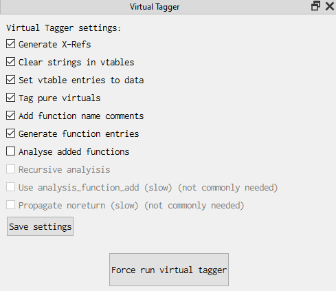
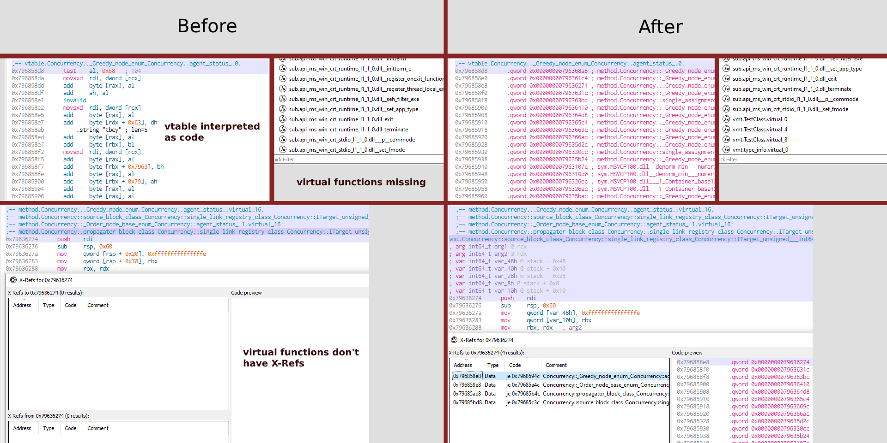

# Virtual Tagger Plugin
Virtual Tagger Plugin is a [Cutter](https://github.com/rizinorg/cutter) plugin that cleans up vtable entries and automatically adds named function definitions (with optional analysis and X-Refs) for virtual functions defined in classes, making it easier to search for/work with VMT functions.

Tested on Windows Cutter release 2.2.0 (with x86 + x64 binaries - should work for most other architectures too)





### Settings/Features
* Generate X-Refs 
  * Generates X-Refs from vtable slot -> function
* Clear strings in vtables
  * Removes string detections that occur inside vtable pointers
* Set vtable entries to data
  * Sets each vtable method entry to data so Cutter interprets it as a pointer
* Tag pure virtuals
  * Runs the tagger on "pure virtual" functions
* Add function name comments
  * Adds a comment to each vtable entry with the name of the function it points to, making it easier to read X-Refs
* Generate function entries
  * Generates function definitions so they show up in the functions panel
* Analyse added functions
  * Runs analysis on virtual functions
  * Function analysis can be enabled + run after generating function entries, but can only be run ONCE
  * If this is disabled, only the first instruction of a virtual method will be associated with it's definition
* Use analysis_function_add
  * Only enable this if you get weird results with it disabled
  * If this is disabled, Virtual Tagger uses a custom faster analysis implementation that is *almost* equivalent to the internal function Cutter uses: rz_core_analysis_function_add
  * If this is enabled, rz_core_analysis_function_add will be used (which can be multiple orders of magnitude slower - can take 10+ minutes to run for some binaries)
  * Must be enabled before first Virtual Tagger analysis in order to work
* Recursive analyisis
  * Enables recursive function analysis
  * Must be enabled before first Virtual Tagger analysis in order to work
* Propagate noreturn
  * If you don't know if you need this, you don't need it
  * Enables propagation of noreturn flags
  * This usually increases analysis time by over 10x
  * analysis_function_add always has this enabled
  * Must be enabled before first Virtual Tagger analysis in order to work

### Notes
Generated names follow the form `vmt.[class name].[function name]` - if there is no symbol for the function name, Cutter will set `[function name]` to `virtual_[VMT offset]`

If multiple classes use the same function due to inheritance, Virtual Tagger Plugin will attempt to find and use the name of the highest-super class that uses the function.

If multiple classes use the same function without sharing a parent class, the name of the first class processed will be used.

### Install
Copy to your Cutter native plugin directory.  
You can find this directory in Cutter via `edit` -> `preferences` -> `Plugins` -> `Plugins are loaded from ...`

### Usage
The plugin should run automatically after analysis is finished.  
The plugin menu can be opened via `Windows` -> `Plugins` -> `Virtual Tagger`  
If you need to re-run the tagger, either use the plugin menu or: right click an instruction or function -> `plugins` -> `Force run virtual tagger` - note that this runs the tagger on ALL virtual functions.

### Compiling:
Add `[cutter install dir]/lib/cmake` to `CMAKE_PREFIX_PATH`  
Add QT5 cmake dir to `CMAKE_PREFIX_PATH` ( `Qt/[version]/[compiler]/lib/cmake/Qt5` on my machine)  
```
md build
cd build
cmake ..
```
Compile using your compiler (compile in `release` mode if you want it to work with release builds of Cutter)
